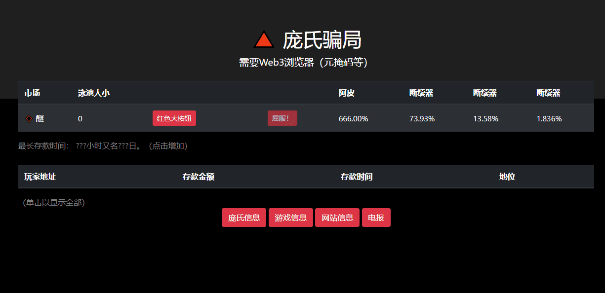

# Ponzi Protocol

**什么是 庞氏协议？**

庞氏协议是 Cronos 区块链上的下一代自动质押协议，以超高可变 APY 和 $WCRO 奖励其持有者，同时保持公平的税收百分比。庞氏协议具有内置的高燃烧和自动流动性引擎，以及与其他类似代币相比的许多其他改进，例如内置的反机器人和更有效的变基算法。

庞氏协议是**下一代自动质押协议**，可奖励其持有者的超高可变APY和$BUSD奖励，同时保留公平的税收百分比。庞氏协议内置了高烧钱和自动流动性引擎，并且与其他类似代币相比还有许多其他改进。

