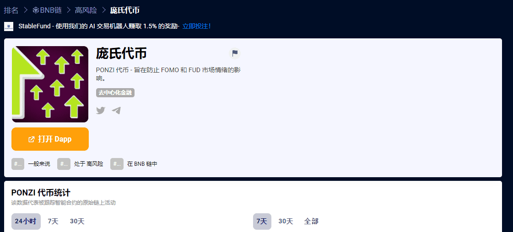

# PONZI Token

**什么是 庞氏代币？**

PONZI 代币是一个 MEME 项目，感谢 [PONZI] 代币，我们将购买加密货币并持有它“直到更好的时期”，从而通过持有它来平衡硬币价格的短期和长期波动的影响。同时，保护自己免受 FOMO 和 FUD 市场情绪的影响——害怕错过。

**这个怎么运作？**

PONZI 代币有 7% 的佣金（买/卖/转让）。

5%，来自（购买/出售/转让）将用于补充项目资金和购买加密货币，2%（营销，在交易所上市）。
每次您购买、出售、转让 PONZI 代币时，我们都会出售代币并用以下硬币（BTC、ETH、BNB、ADA、SOL、XRP、LUNA、DOT 等）补充我们的社区基金。这些资金将成为一个普通的社区存钱罐，在达到 100% 盈利时出售，并将 PONZI 代币兑换成收益金额并销毁。

**PONZI Token 的独特之处是什么？**

每天都有大量的 MEME 项目出现，但这些项目使用了棘手的代币经济学，而这些项目的增长只是由于新的持有者的到来。我们的代币经济学很简单，它建立在整个加密货币市场的增长之上，我们相信金融世界的未来在于加密货币。而我们的谨慎和诚信将使 PONZI 代币成为 BNB 智能链网络中的成功项目之一。您不需要投资大量的项目，我们会为您做。而且由于我们的投资组合将包含 10 多个硬币，而且这个数字每个月都会增加，因此您最终会得到一个由 100 多个硬币 (1x100) 支持的 PONZI 代币。

