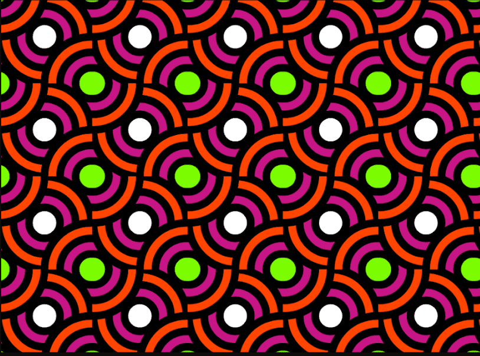

# PonziRugs

完全隐形发射。没有网站。没有营销。只有三个朋友和一份合同。最初是 0.06Ξ 的 1250 集合。我们从来没有铸造出来。

我们限制了收藏并继续建造。只有 307 个庞氏地毯存在；集合的其余部分会丢失，直到时间结束。

我们的收藏很特别，因为它 100% 在以太坊区块链上存储和生成。没有 IPFS。没有 API。Ponzi Rugs 专为您的 Discord 和 Twitter 横幅而设计。

拥有地毯，您可以获得独家赠品和其他令人惊喜的乐趣。它们对于我们的[V2 项目](https://medium.com/@KingpinNFTs/ponzi-rugs-v2-the-pull-theory-cb04b1b461c7)也是必不可少的。

来点粗壮的。

