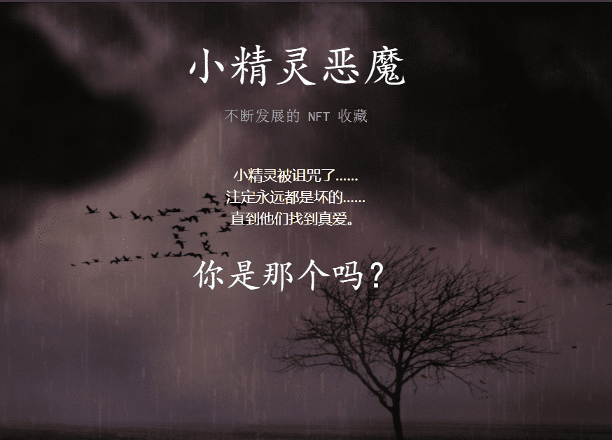

# Pookie Demons

与常规 NFT 不同，其想法是 ENFT 可以随着时间的推移“进化”。找到真爱后，恶魔变成了天使。每个 Pookie Angel 都不是随机创建的，它基于它进化而来的原始恶魔的相同特征。如果您拥有 Pookie Demon，我们将给您第一次机会命名它变成的天使 NFT！此外，拥有一个 Pookie Demon 可以让您真正参与到我们计划在区块链中推出的机会世界中，比如拥有一只宠物或找一份工作！

Pookie Demons 是 666 种独特 ENFT 的有限集合，因此，如果您想成为 NFT 技术下一步发展的一部分，请在它们全部消失之前购买您的恶魔！

