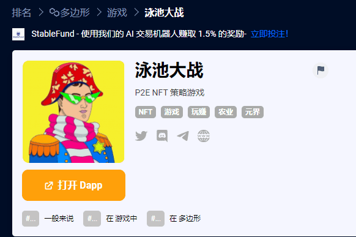

# Pool Wars

**什么是 泳池大战？**

我们正在创建历史上最强大的军阀的独特 NFT 肖像收藏。我们的社区将有机会获得奖池为 100,000 美元的“征服者之战”游戏。要参与，您应该至少铸造 50,000 个军阀中的一个。

为了比其他玩家更有优势，您可以使用特殊的 NFT 卡升级您的军阀。每张卡可以提高攻击、防御和智力三个参数之一。此外，卡片将允许访问POOLWARS 事件在第 0 阶段，您可以参与这些卡的空投。

泳池战争是**刚果共和国与该国东南部的一个省池部的忍者民兵之间的冲突**。在宾特萨穆对宪法的修改提出异议后，弗雷德里克·宾特萨穆（也称为恩图米牧师）和刚果总统丹尼斯·萨苏-恩格索之间的紧张关系加剧。

