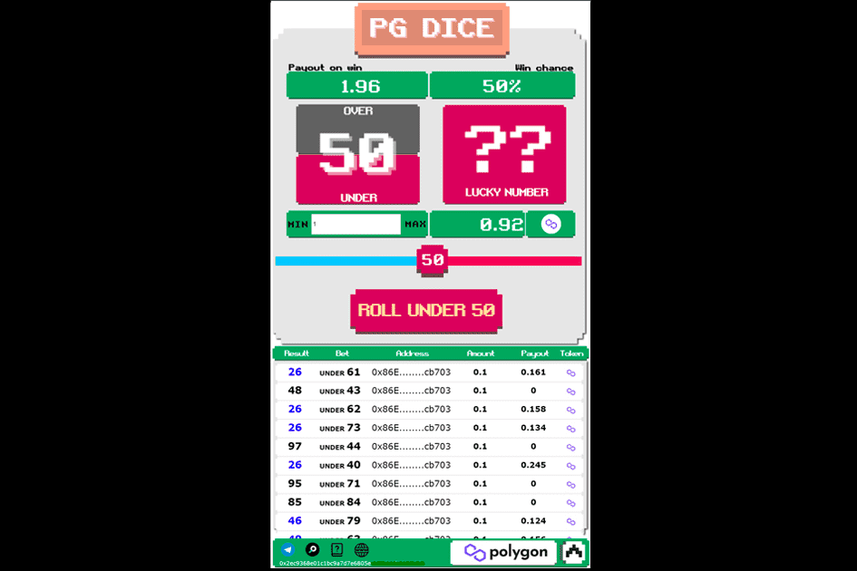

# Poolgame.io

**什么是 Poolgame.io ？**

Poolgame.io 是一个去中心化的赌博协议，在 Polygon 上具有可证明的随机数随机源。我们授权玩家、开发者、游戏供应商和代理机构参与一个对所有人开放且可访问的游戏市场。

你的目标是把所有其他球员的球从桌子上推出来。这个游戏在每个回合，不同的布局和对手都会变得更加疯狂！

**如何玩台球 IO**

选择球的颜色，并在单击“播放”按钮之前输入您的首选游戏内名称。游戏将从随机的桌子布局和玩家开始。

规则很简单：避免在你试图自己推动他们的时候被其他玩家推下桌子。每次你把对手的球从桌子上推下来时，你的球就会变大。对手的球越大，你把它从桌子上推下来的奖励就越多。

