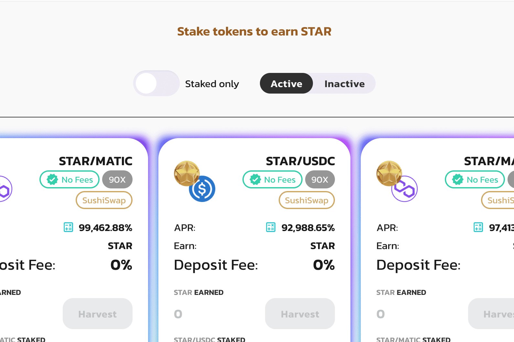

# Poolsar

**什么是 Poolsar ？**

高APY的DeFi项目。多层农场。建立在代币工厂之上。

Poolsar是一个具有多层的农业平台。它在多边形网络上运行。令牌工厂是平台的基础。STAR是平台的原生令牌。它可以通过抵押LP代币获得。

Poolsar dApp是建立在多边形协议上的DeFi类别的加密资产。现在，根据用户数量，它在一般的dApp排名中排名第1176位，在DeFi类别中排名第338位，这使您可以很好地了解Poolsar dApp在其竞争对手中的表现。

通过分析Poolsar dApp在过去30天内的数据，很明显，dApp的余额为0.00美元，交易量稳定在0.00美元。Poolsar已经产生了19笔交易，在30天内增长了18.75%。显然，与前7天相比，交易量稳定了0%。过去7天的数据显示，Poolsar用户群为18，并且一直在增长66.67%。
