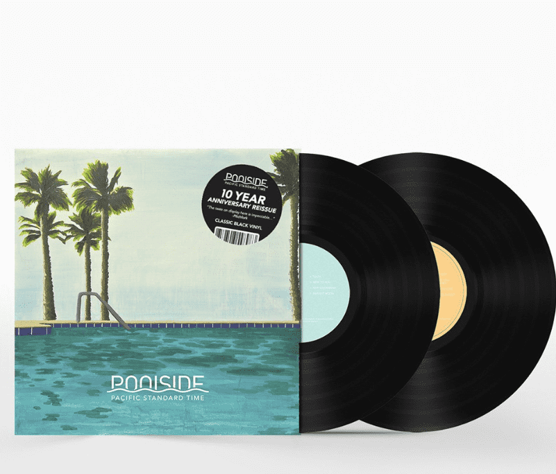

# Poolside Music

Poolside 是制作人、词曲作者和多乐器演奏家 Jeffrey Paradise 的录音项目。Poolside 于 2011 年初在洛杉矶一座改建的后院泳池房开始，当时 Paradise 开始了一段低风险的旅程，为夏季晚会制作适当的寒冷音乐，这是一种轻盈但可跳舞的音乐，具有阳光的氛围和流畅的节奏，他称之为“白天迪斯科”。从那时起，Poolside 发行了四张广受好评的专辑——太平洋标准时间（2012 年）、热火（2017 年）、淡季（2020 年）和旺季（2021 年）——混音了比利·偶像、杰克·约翰逊和 Milky Chance 等无数知名艺人、Miami Horror、Rhye、L'impératrice 等，并作为一支强大的五人现场乐队在全球巡回演出近十年，在全球主要舞台上演出，包括 Coachella、Outside Lands、

