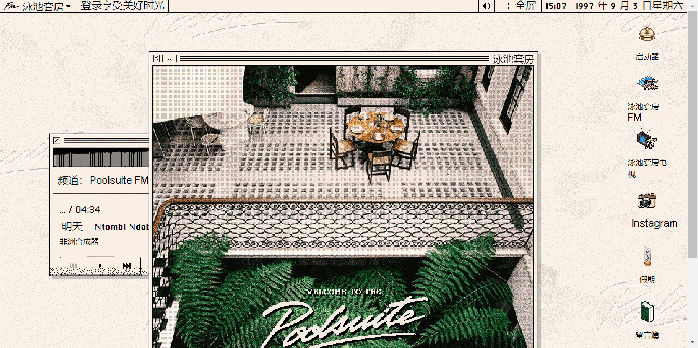

# Poolsuite - Executive Member

Poolsuite - 执行会员 NFT - 常见问题（FAQ）
▶ 什么是 Poolsuite - 行政会员？
Poolsuite - 执行会员是一个 NFT（不可替代代币）集合。存储在区块链上的数字艺术品集合。
▶ 有多少 Poolsuite - Executive Member 代币存在？
总共有 2,500 个 Poolsuite - 执行成员 NFT。目前，1,944 位业主的钱包中至少有一个 Poolsuite - Executive Member NTF。
▶ 什么是最昂贵的 Poolsuite - Executive Member 销售？
售出的最昂贵的 Poolsuite-Executive Member NFT 是 Poolsuite-Executive Member 2439/2500。它于 2022 年 7 月 1 日（2 个月前）以 3,000 美元的价格售出。
▶ 最近售出了多少台 Poolsuite - Executive Member？
过去 30 天内售出了 85 个 Poolsuite - Executive Member NFT。
▶ 泳池套房 - 行政会员的费用是多少？
在过去 30 天里，最便宜的 Poolsuite - Executive Member NFT 销售额低于 1087 美元，最高销售额超过 2736 美元。Poolsuite - Executive Member NFT 在过去 30 天内的中位数价格为 1811 美元。
▶ 流行的 Poolsuite - Executive Member 替代品有哪些？
许多拥有 Poolsuite - Executive Member NFT 的用户还拥有 Floor App Gen 3、 Quantum Key、 Floor App Gen 2和 CPG Pop: by "Crypto Packaged" GOODS。

