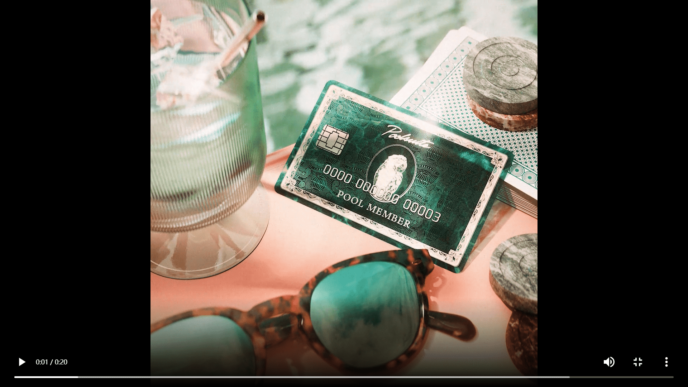

# Poolsuite - Pool Member

Poolsuite - 泳池成员统计数据
创建于 9 个月前
250 代币供应
10% 费用
23,364 位推特关注者
Poolsuite - Pool Member NFT 在过去 7 天内售出 1 次。Poolsuite - Pool Member 的总销售额为 $2.07k。一个 Poolsuite - Pool Member NFT 的平均价格为 2.1 万美元。有 237 个 Poolsuite - Pool Member 所有者，拥有 250 个代币的总供应量。

最初是送给 Poolsuite Internet Leisure Organisation 的朋友和恩人的礼物，持有这张卡意味着与互联网上最悠闲的“上层人士”有着牢固的联系。此 NFT 可以连接到您在 Poolsuite.net 上的帐户以解锁特权，包括提前访问选定的 Poolsuite 项目。

