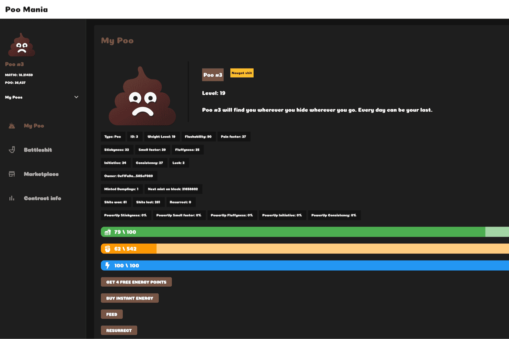

# PooMania

**PooMania是什么？**

Poomania 旨在为其用户提供一种类似于 Tamagotchi-meets-Pokémon 的体验，在那里他们可以与他们独特的一堆狗屎进行互动。是的，你没看错。因此，该团队推出了一个 dApp，它允许用户铸造他/她自己的独特便便。一旦用户铸造了便便，他可以通过将其送入与其他便便的战斗来帮助它成长，使其获得经验，提高其等级并增强其整体实力 - 同时通过偶尔喂它来照顾它。因为老实说：谁在做完厕所后没有看厕所，如果厕所是一大堆，谁会为自己的成就感到自豪。

用户通过游戏获得的奖励是独特的 Poomania 代币 (POO)，它只能在狗屎大战中铸造，并将用作游戏内货币。由于游戏是 100% 区块链驱动的，用户和他/她的便便之间的每次交互都是 Matic 区块链上的交易，每个人都可以看到。这使得游戏独一无二，因为大多数其他区块链驱动的项目都依赖于存储在区块链上的 NFT（在大多数情况下仅包含指向链下存储图像的链接），而所有游戏逻辑都在链下执行和存储- 将意志的力量留给开发商。

想象一下，如果他们的服务器关闭并且不再为他们的 NFT 或游戏逻辑提供艺术品会发生什么——这不会发生在 Poomania 选择的方法中。所以没有狗屎表演可能。欢迎来到加密游戏行业的未来。欢迎来到去中心化游戏。

由于大多数其他区块链驱动的项目依赖于存储在区块链上的 NFT（在大多数情况下仅包含指向链下存储图像的链接），而所有游戏逻辑都在链下执行和存储 - 留下意志的力量给开发商。想象一下，如果他们的服务器关闭并且不再为他们的 NFT 或游戏逻辑提供艺术品会发生什么——这不会发生在 Poomania 选择的方法中。

所以没有狗屎表演可能。欢迎来到加密游戏行业的未来。欢迎来到去中心化游戏。由于大多数其他区块链驱动的项目依赖于存储在区块链上的 NFT（在大多数情况下仅包含指向链下存储图像的链接），而所有游戏逻辑都在链下执行和存储 - 留下意志的力量给开发商。想象一下，如果他们的服务器关闭并且不再为他们的 NFT 或游戏逻辑提供艺术品会发生什么——这不会发生在 Poomania 选择的方法中。所以没有狗屎表演可能。欢迎来到加密游戏行业的未来。

欢迎来到去中心化游戏。想象一下，如果他们的服务器关闭并且不再为他们的 NFT 或游戏逻辑提供艺术品会发生什么——这不会发生在 Poomania 选择的方法中。所以没有狗屎表演可能。欢迎来到加密游戏行业的未来。欢迎来到去中心化游戏。

想象一下，如果他们的服务器关闭并且不再为他们的 NFT 或游戏逻辑提供艺术品会发生什么——这不会发生在 Poomania 选择的方法中。所以没有狗屎表演可能。欢迎来到加密游戏行业的未来。欢迎来到去中心化游戏。

