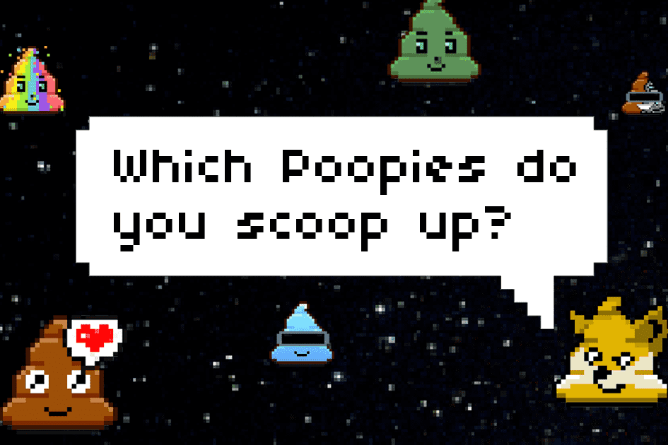

# Poopies

**什么是 Poopies？**

Poopies 是自动生成的最糟糕的 NFT 中的 10.000 个。Poopies 存在数百种形状和颜色，每一种都具有不同的稀有性和独特性。当你拥有你的狗屎时，你不只是拥有一件垃圾，你拥有一件独特的艺术品。

**收集稀有的数字垃圾**

Poopies 是最糟糕的自动生成的 NFT 的有限集合，其中代币本身兼作 Poopies 会员休息室的会员资格。俱乐部开张了！

便便有不同的颜色，可能意味着不同的东西，主要取决于你吃过的东西。如果你有幸发现了一个闪闪发光的神圣粪便，那么你就拥有了一个独特且极为罕见的便便便士。粪便的气味可能是由你吃的食物引起的。每个 Poopie 都有自己独特的气味。有些滴只是感觉与其他滴不同。“一个雨刷”永远是金！

