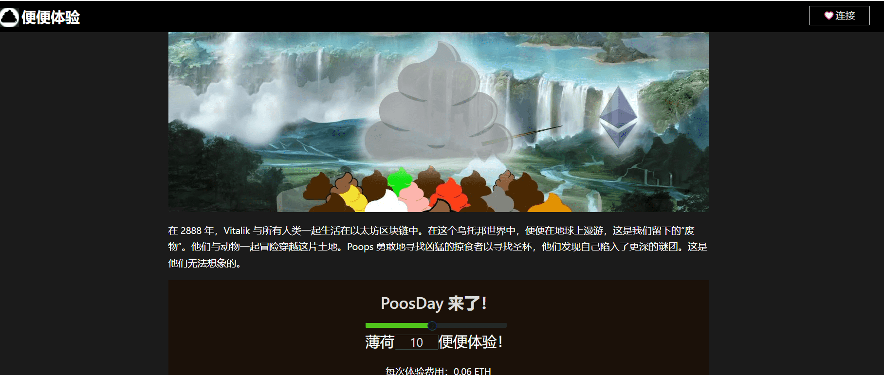

# Poopy Bloot (not for Weaks)

PoopyBLOOT 或 pBLOOT 或 pLOOT...

受 BLOOT 启发，我们添加了我们的专长，这是一个基于文本的交互式 NFT

在 etherscan 上获取您的BLOOT 持有者：1-8008 claimForBlootFREE for Everyone：8009 - 12907 claim

在 2888 年，Vitalik 与所有人类一起生活在以太坊区块链中。在这个乌托邦世界中，便便在地球上漫游，这是我们留下的“废物”。他们与动物一起冒险穿越这片土地。Poops 勇敢地寻找凶猛的掠食者以寻找圣杯，他们发现自己陷入了更深的谜团。这是他们无法想象的。

Poopy Experiences 是世界上第一个以编程方式生成的 10,000 个交互式 ERC-721 NFT。每个都包含由 Poopy 科学家手工制作的独特体验，他们为 NFT 世界带来了交互性！这些体验将可供任何人在 OpenSea 上进行交互，从而为 NFT 社区和市场带来标志性的全新体验！每个 Poopy 体验都特定于 NFT 本身。拥有 100 多种特征和 2000 万多种组合，没有两个 Poopy 体验是相同的。除了特征之外，每个 Poopy Experience NFT 的独特之处在于捆绑在 NFT 中的体验的安排。[无论是难度等级、地图布局还是粪便科学家在实验室中制作的其他参数！]。这些体验将随着时间的推移而增长，并随着便便体验实验的继续而发展。这是 Poopy Universe、NFT 世界中高度实验性的部分。Poopy 科学家是最棒的，尽情享受吧！Poopy Experiences 将在我们的 poopy 网站上从 0.06 ETH 开始铸造，请参阅我们的 Discord 公告以了解 Poopening 的时间！！

