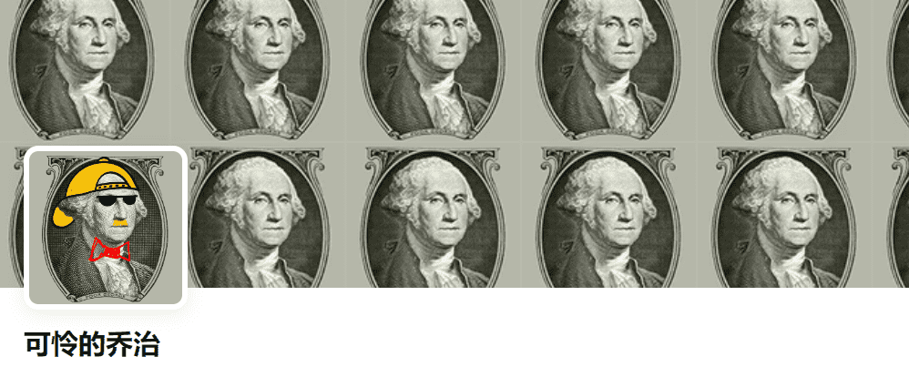

# Poor George

可怜的乔治，一半嘲讽，一半忧郁；这是秋天之前的骄傲故事。名义上的乔治既是他自己的角色，也是男人特别粗心的象征，尽管叙述者对这个角色表示同情，因为乔治在每节经文中都变得更加黑暗，并对乔治在最后暗示的灾难性死亡做出尖叫悲伤的反应，整首歌有一种可悲的感觉，真正放大了信息。这是一个我非常熟悉的故事，它的河流般的凹槽——带着它安静的荒凉——被一把锯齿状、锋利的吉他美妙地强调了出来。《可怜的乔治》是对一个从某种意义上说从一开始就没有出生的人的终极悼词。

