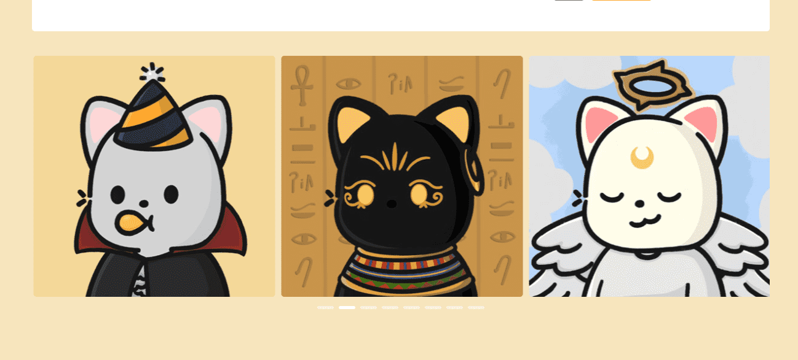

# Pop Cats NFT

我们是流行猫。手绘、程序化、随机生成的 NFT 生活在以太坊区块链上。

这一代流行猫仅由 8,888 只随机组装的猫组成，来自超过 30 万种可能的组合。

我们全心全意地创建了这个项目。我们希望我们的 Pop Cats 尽可能特别。从眼睛、嘴巴到 T 恤、连帽衫和其他独特的配饰，使其与众不同。一些流行猫会特别特别，但这并没有让它们变得不那么可爱和可爱。

希望 Pop Cats 能给您带来欢乐、爱以及我们小时候都曾拥抱过的纯洁和纯真。

