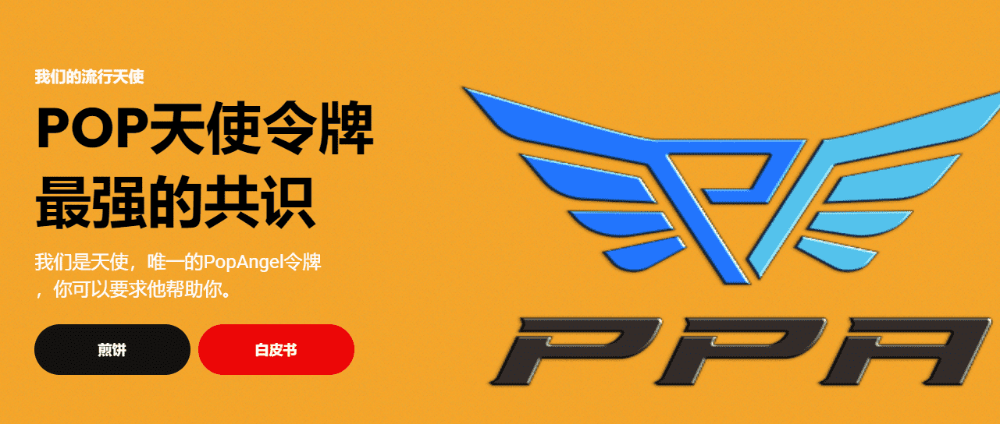

# PopAngel

**什么是 PopAngel？**

欢迎来到 PopAngel。Polygon 网络上的下一个 DeFi。质押您的 NFT 并赚取更多 PPA 高达 3.8 倍。还有高达 20% 的 10 代推荐奖金。

Pop Angel（$PPA）是一种以社区为中心的分散式加密货币，旨在成为该区块上最强大的共识硬币！您将能够将任何BSC代币兑换成BNB或USDT，这些代币可用于购买$PPA代币。

它将首先在平衡计分卡网络上推出，然后在天使网络上推出。两者之间的桥梁将使平衡计分卡的人将来更容易进入天使项目。

$PPA令牌在币安智能链上可用。MetaMask是BEP20（BSC）钱包的市场领导者。在谷歌浏览器上，请访问 metamask.io 下载扩展程序并设置钱包。在移动设备上？获取MetaMask适用于iPhone或Android的应用程序。
