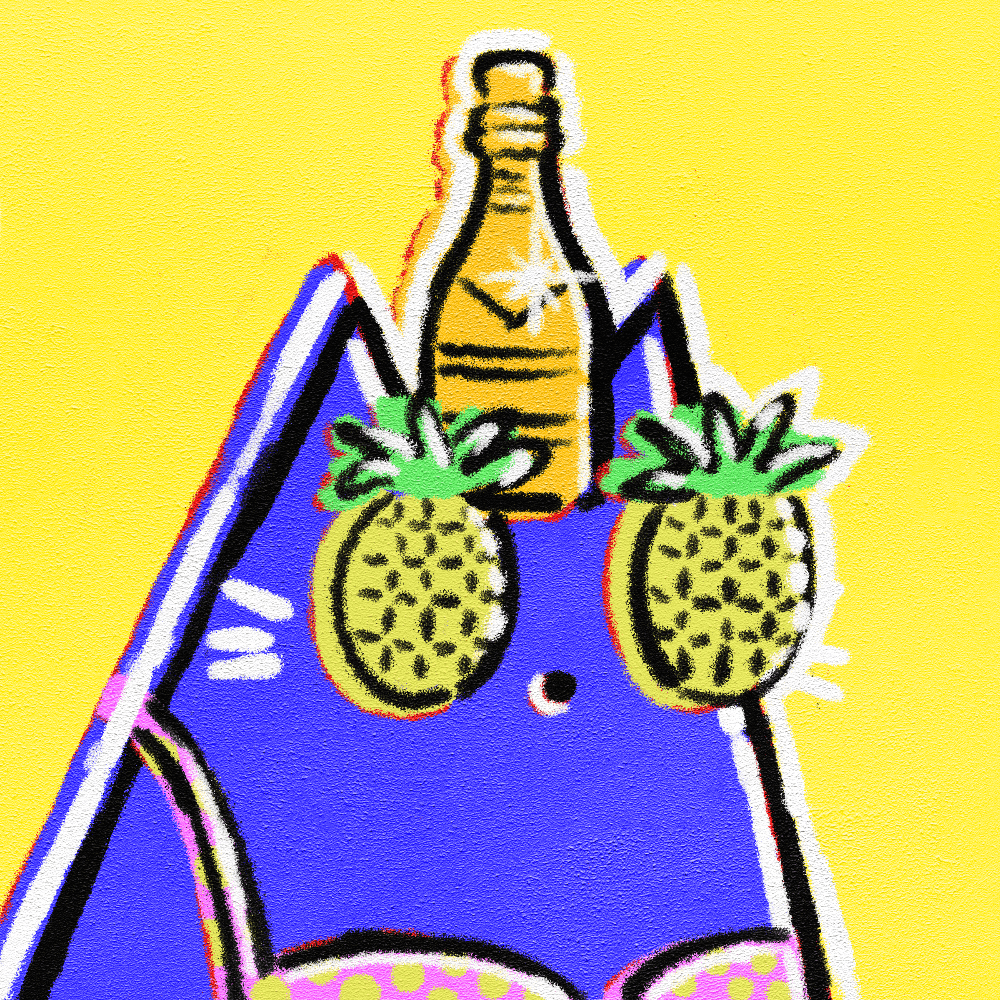

# Pop Art Cats by Matt Chessco

关于艺术家
Matt Chessco 是加拿大蒙特利尔的前工业设计师和机械工程师。

两年前，马特决定追随他成为一名全职艺术家的梦想。此后，他在 YouTube 上获得了超过 140 万订阅者，在 TikTok 上获得了 270 万关注者。他独特而有趣的视频被观看超过 15 亿次。

马特曾与世界上最大的艺术家和品牌合作，包括贾斯汀比伯、埃德希兰、三星和迪士尼。

什么是 NFT？

NFT 代表不可替代的代币，它是一种生活在区块链上的数字创作。NFT 可以采取多种形式。它们可以是视频、动画、声音或图像。更多信息在这里。

我在哪里可以买到波普艺术猫？

你可以在 NFT 市场上购买波普艺术猫。我们建议使用 OpenSea，但您也可以使用 LooksRare。单击此处获取 OpenSea。 单击此处查看 LooksRare。

购买 Pop Art Cats NFT 需要什么？

要购买 Pop Art Cats NFT，您需要一个加密钱包（例如MetaMask）和该钱包中的一些以太坊。

