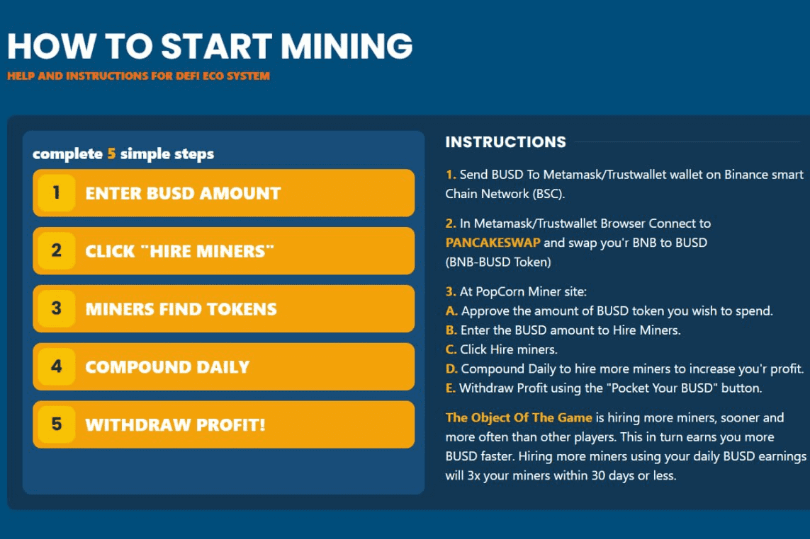

# POPCORN BUSD MINER

**什么是POPCORN BUSD MINER？**

当我购买矿工时会发生什么？：当您购买矿工时，您的BUSD被锁定在PopCorn BUSD智能合约中，并奖励您“高达”的每日回报。

矿工是一个“功能”，它不是一个令牌。如果有人使用或听说过BakedBeans，它的工作原理完全相同。
我可以把我最初的 BUSD 带回去吗？：随着时间的推移！矿工不被购买，矿工被开采，因此他们不能被出售。一旦Waves被开采，它们就会无限期地为您工作，以每天16%的起始率为您提供无限量的BUSD。

我的费用是多少？：为了支付营销成本和进一步发展PopCorn.Claims生态系统，需要支付5%的开发费用。

什么时候是购买矿工的最佳时机？：总是！无论您何时雇用矿工，您都将以每天16%的回报率开始。
我应该多久复配一次？ 我们建议您每天至少复合一次，但您可以随意这样做。

推荐如何运作？ 一旦您的BSC钱包连接到$POPCORN Dapp，您会注意到您的推荐地址出现在页面底部。当新用户在点击您的个人推荐链接后雇用矿工时，合约将立即向您的PopCorn矿工发送等于13%的BUSD值。要聪明，用它来购买矿工，为自己建立收入来源。

Compound再次将矿工放入矿工，而Surf Miners正在将矿工带走。

