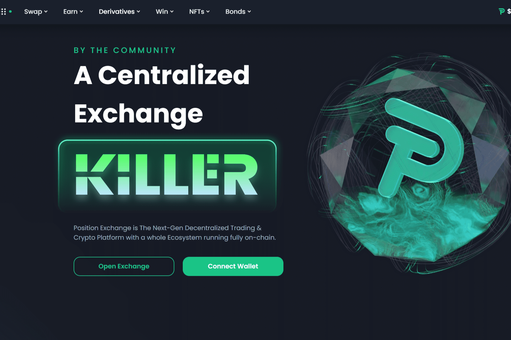

# Position Exchange

**什么是 Position Exchange？**

Position Exchange 是一个去中心化的加密平台，具有完整的生态系统，旨在弥合人与加密货币之间的差距并增强 DeFi 体验。

该协议完全由其社区拥有和管理，并在一个一切都在链上运行的开放、透明和去信任的系统中为各种用户提供广泛的 DeFi 产品。

用户可以交易加密货币衍生品，通过耕种和质押产生被动收入，投资和借贷，潜入 NFT 世界，在真正的去中心化系统中参与治理和社区活动。

