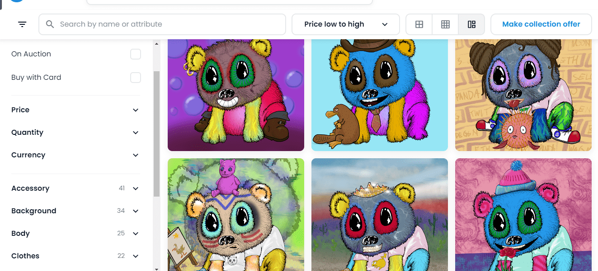

# Positive Pandas

##### ▶ 什么是正面熊猫？

Positive Pandas 是一个 NFT（Non-fungible token）集合。存储在区块链上的数字艺术品集合。

##### ▶ 有多少 Positive Pandas 代币？

总共有 6,999 个 Positive Pandas NFT。目前，1,536 名所有者的钱包中至少有一个 Positive Pandas NTF。

##### ▶ 最近卖出了多少只 Positive Pandas？

过去 30 天内售出了 3 个 Positive Pandas NFT。

