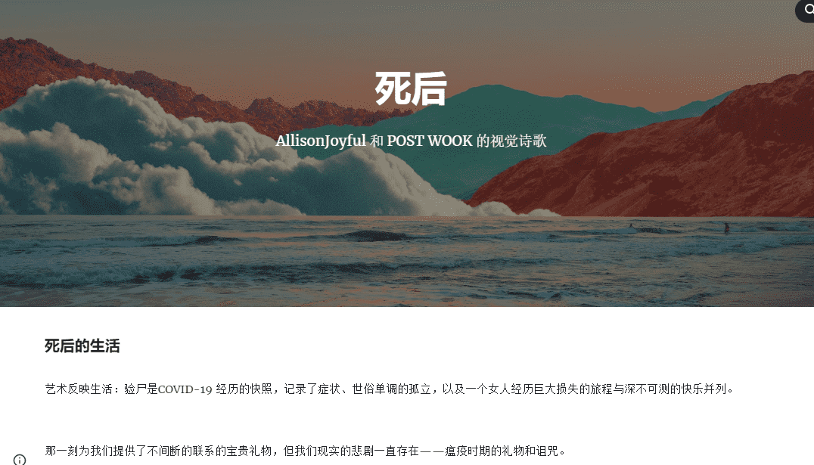

# post mortem poetry

死后的生活

艺术反映生活：验尸是 COVID-19 经历的快照，记录了症状、世俗单调的孤立，以及一个女人经历巨大损失的旅程与深不可测的快乐并列。该系列是这场大流行病的时间胶囊，这场大流行病夺走了 628 万个灵魂，其中包括作者的父亲。它是一种促进共同创伤的集体处理的产品。我们一起变得更强大、更有韧性、更专注于我们想要居住的世界。1/1 NFT 被铸造到 $pmrtm ETH 智能合约中。ExchangeArt (SOL) 上提供限量版。作为一个跨链项目，死后奖励持有 ETH 和 SOL 碎片的收藏家。

