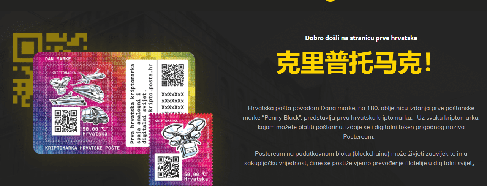

# Postereum

使用每个加密邮票，您可以支付邮资，并发行具有适当名称 Postereum 的数字代币。Postereum 可以在区块链上永存，具有收藏价值，从而实现集邮向数字世界的忠实转化。我们比朋友更经常在街上看到他们。我们所见之处，货车不知疲倦地冲着运送某人的货物。我们的大多数生活事件都涉及一辆面包车——从搬家到送婚纱。货车是邮政车队中数量最多的车辆。它们最常用于运输较大的物品并提供快递服务。考虑到气候变化，货车变得越来越安静，并且越来越多地由电力驱动。在克罗地亚各地，从高速公路到当地的小路和小路，黄色的邮政货车都很容易辨认。

