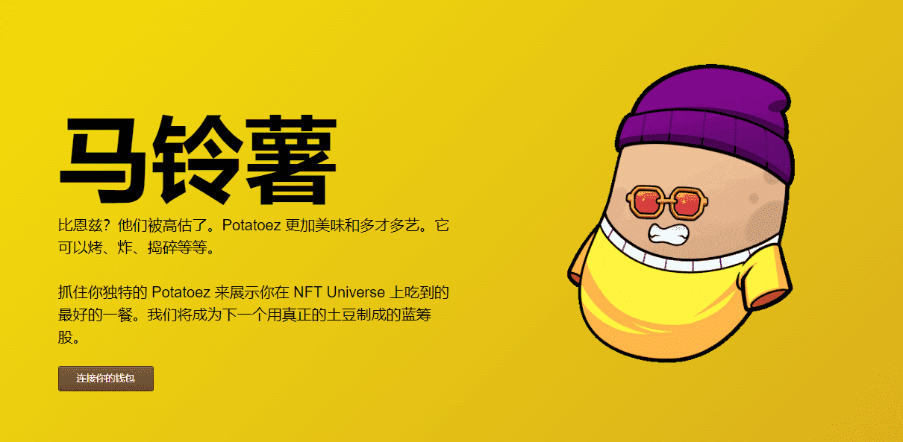

# Potatoez

它可以烤、炸、捣碎等等。抓住你独特的 Potatoez 来展示你在 NFT Universe 上吃到的最好的一餐。我们将成为下一个用真正的土豆制成的蓝筹股。

##### ▶ 什么是土豆？

Potatoez 是一个 NFT（不可替代代币）集合。存储在区块链上的数字艺术品集合。

##### ▶ 有多少 Potatoez 代币？

总共有 4,500 个 Potatoez NFT。目前，542 位所有者的钱包中至少有一个 Potatoez NTF。

##### ▶ 最近卖出了多少 Potatoez？

过去 30 天内售出 0 个 Potatoez NFT。

