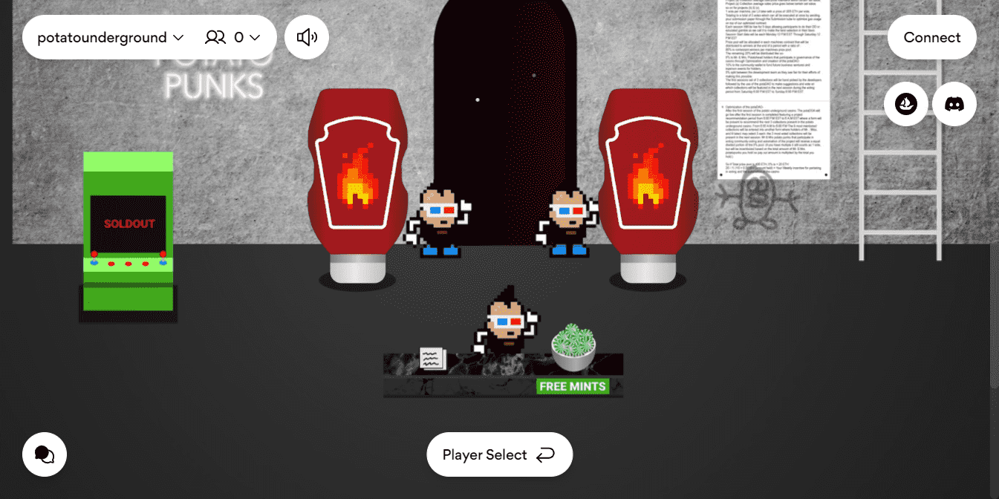

# PotatoPunks

PotatoPunks NFT - 常见问题（FAQ）
▶ 什么是 PotatoPunks？
PotatoPunks 是一个 NFT（非同质代币）集合。存储在区块链上的数字艺术品集合。
▶ 有多少 PotatoPunks 代币？
总共有 5,555 个 PotatoPunks NFT。目前，1,388 位所有者的钱包中至少有一个 PotatoPunks NTF。
▶ 最昂贵的 PotatoPunks 销售是什么？
售出的最昂贵的 PotatoPunks NFT 是 PotatoPunk #5165。它于 2022-06-17（3 个月前）以 9.9 美元的价格售出。
▶ 最近卖出了多少 PotatoPunks？
过去 30 天内售出了 4 个 PotatoPunks NFT。
▶ 什么是流行的 PotatoPunks 替代品？
许多拥有 PotatoPunks NFT 的用户还拥有 Scallywags、 MGC NFT、 Wicked Craniums Comic和 NFT Siblings Avatars。

