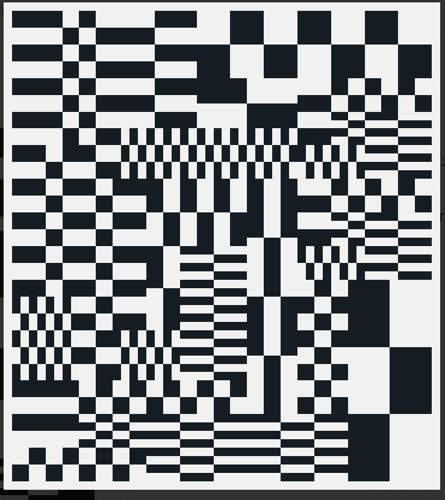

# POTEnZA

POTE(n)ZA是由艺术家Gavin Potenza创作并由Archethect编码的一系列通缩的生成 NFT 。
每件艺术品都由一种算法独特地组成，构建复杂的块和图案序列。
OTE(n)ZA是一项可追溯到2018年初的视觉研究，通过图案、形状和颜色的序列来研究数据和隐私的矛盾性质。
该系列开始完全手工制作，作为将区块链上的数据人性化的一种方式，在每个组合中寻求和谐与混乱的平衡。
研究发展到一个新的领域是很自然的，建筑师领导将手工制作转化为生成艺术。

