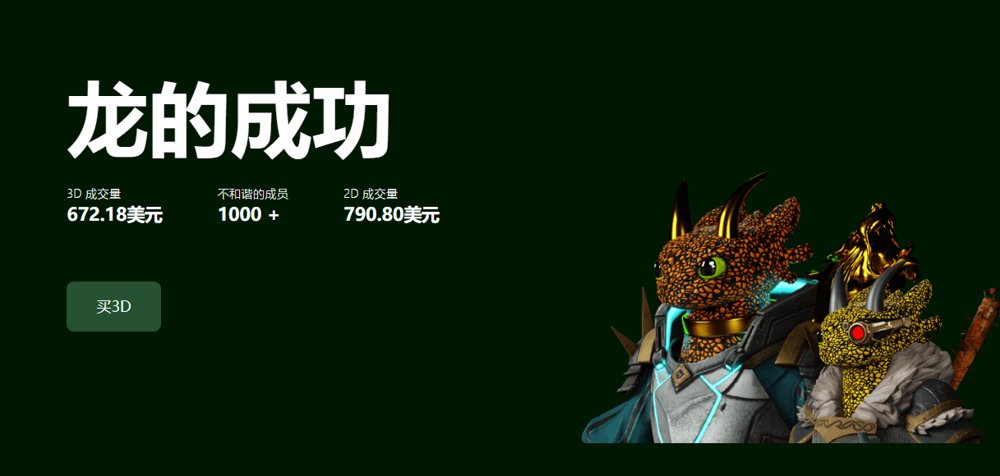

# Potion X

在人类之前，有成千上万的龙生活在龙洲群岛他们正在探索龙洲，因为他们在龙洲中发现了一个神话般的门户，门户是如此美丽，以至于他们决定进入它......
当他们进入门户时......他们看到了一些变异石一接触到这些石头，它们就开始变异，每天都进化出新的能力、新的服装、新的能量核心！

但一切并不总是顺利！如果有上帝，也有邪恶。能量核心开始对龙产生反应，一些龙完全无赖！我们不知道 100% 的能量核心能做什么，因为人类正在通过虚拟现实进入我们的 Dragonverse！我们也许可以在 Dragonverse 中保持平衡！

