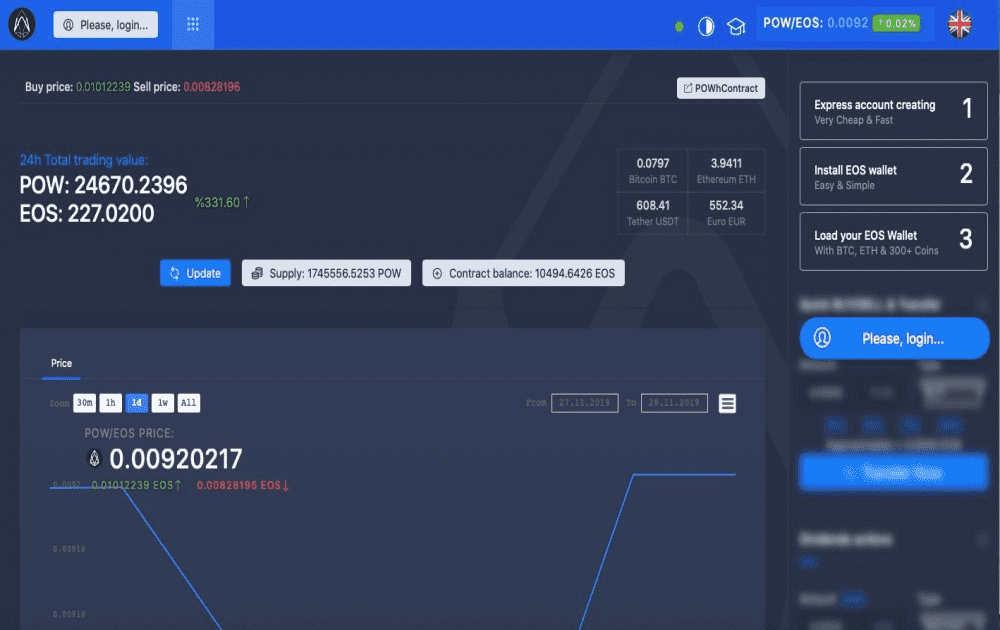

# POW Ecosystem

**什么是 POW Ecosystem？**

POW 是一个基于 EOS 的交易所，它以透明和可验证的方式将平台上的活动（代币购买、出售或转让）收益分享给所有 POW 代币持有者。价格设定机制在智能合约中定义。Exchange dApp 在完美的经济模拟下运行，每个 POW 代币都授予您所有加密货币数量的股份。

POW基于EOS决定的代币交易所，向POW持币者平台的（代币购买、销售或智能手机），分享方式透明且透明。我们使用合约来定价活动。所有交易所dApp在完美的模拟经济环境下，POW代币都让你获得所有加密货币运行的多种权益。

