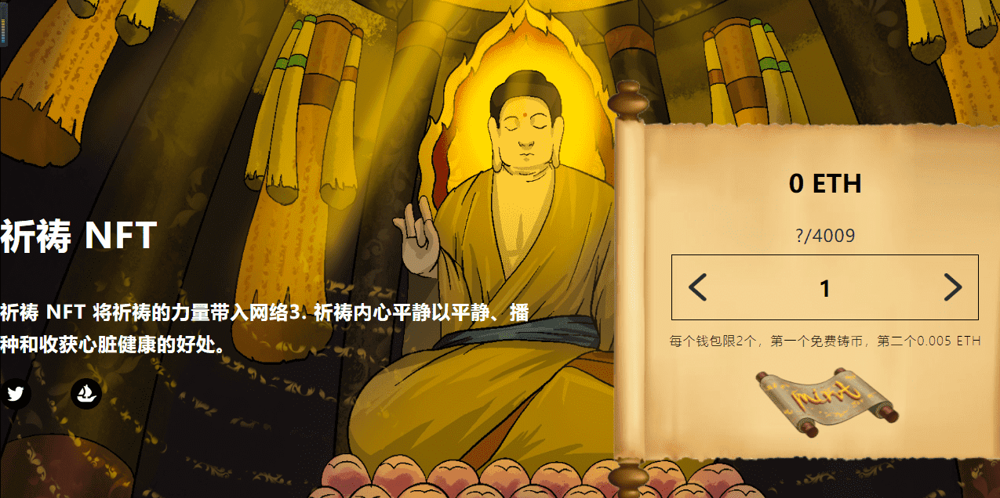

# PrayersNFT

##### ▶ 什么是拉辛格的祈祷？

LASSINGER 的 THE PRAYERS 是一个 NFT（非同质代币）集合。存储在区块链上的数字艺术品集合。

##### ▶ LASSINGER 代币的 THE PRAYERS 有多少？

LASSINGER NFT 共有 14 个《祈祷》。目前有 4 位所有者的钱包中至少有一本 LASSINGER NTF 的 THE PRAYERS。

##### ▶ LASSINGER 的《THE PRAYERS》最近卖出了多少？

在过去 30 天内售出 0 个 LASSINGER NFT 的 THE PRAYERS。

