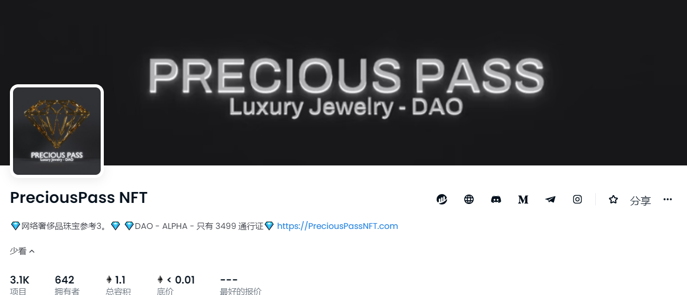

# PreciousPass NFT

Precious Pass NFT PROJECT，供应：3499，白名单铸币厂价格：0.045，公共铸币厂价格：0.066 Precious Pass 是在以太坊区块链上创建的 3499 NFT 的集合。49 个稀有钻石通行证 = 49 个钻石吊坠（查看我们的 Twitter 和 discord 了解更多信息）。道和阿尔法：60% 的销售额分配给社区钱包 获得社区投票 - 钱包直接纳入不和谐提供不同的自助服务工具（Icy 工具、nft 日历（eth/sol）、moby 警报、degenmint.xyz、nftflip.ai 等）和音量跟踪器（检查类别“ALPHA”）访问不同的日常分析/Alpha Call（检查类别“ALPHA”） - 访问未来的 NFT 项目日历参加不同的抽奖活动：WL 现货、免费 NFT、IRL 珠宝掉落......

