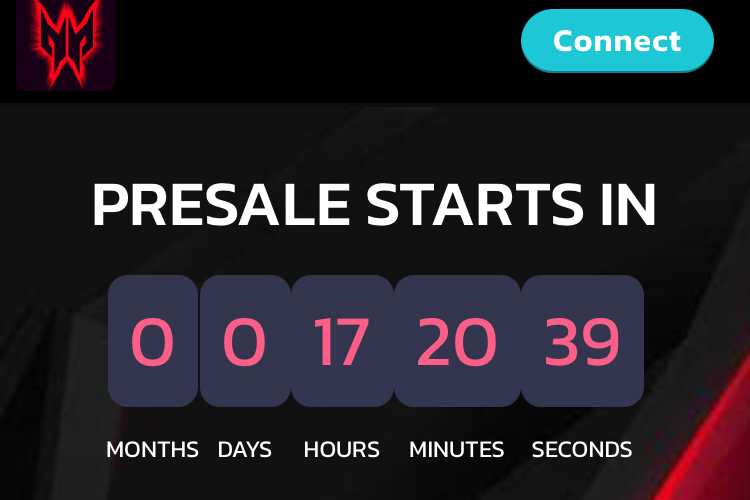

# Predator Finance

**什么是 Predator Finance？**

将改变游戏规则的 DEFI

Predator Finance是一个由平衡计分卡驱动的dApp。这些项目是一个DeFi平台。在上面，您将能够以被动方式赚取加密代币。这也可以匿名完成。这是因为Predator Finance是一个分散和自主的项目。

Predator Finance dApp是建立在Binance Smart Chain协议上的DeFi类别的加密资产。现在，根据用户数量，它在一般dApp排名中排名第5724位，在DeFi类别中排名第1215位，这使您可以很好地了解Predator Finance dApp在其竞争对手中的表现。

通过分析过去30天窗口的Predator Finance dApp数据，很明显，dApp的余额为0.00美元，交易量稳定在0.00美元。Predator Finance在30天内产生了0笔交易，下降了100%。显然，与前7天相比，交易量稳定了0%。过去7天的数据显示，Predator Finance用户群为0，并一直稳定在0%。

