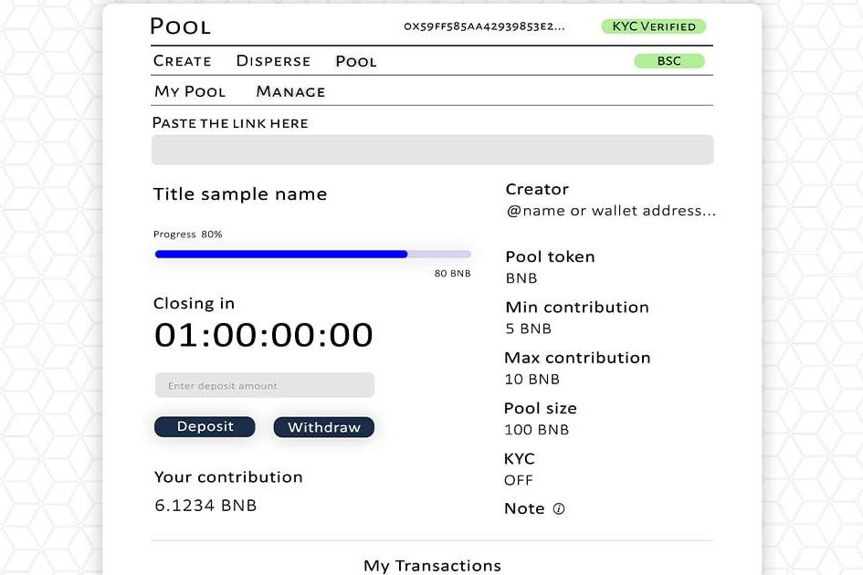

# PremiumBlock

**PremiumBlock是什么？**

Premium Block 开启了在无需许可的池创建的多链网络上进行私人销售/筹款或预售的可能性。

Premium Block 平台还为项目所有者提供了启用 KYC 并将参与者列入白名单的选项。DApp 连接以太坊、Polygon、币安智能链、OKEx 链和火币生态链网络。通过更改钱包 RPC 网络，用户可以通过单击按钮在网络之间无缝切换。

Premium Block 还致力于开发一种通过游戏赚钱的 GameFi 产品，该产品具有 NFT 收藏品奖励和交易 NFT 收藏品的市场。Premium Block 将于 2022 年第一季度推出元界概念。

