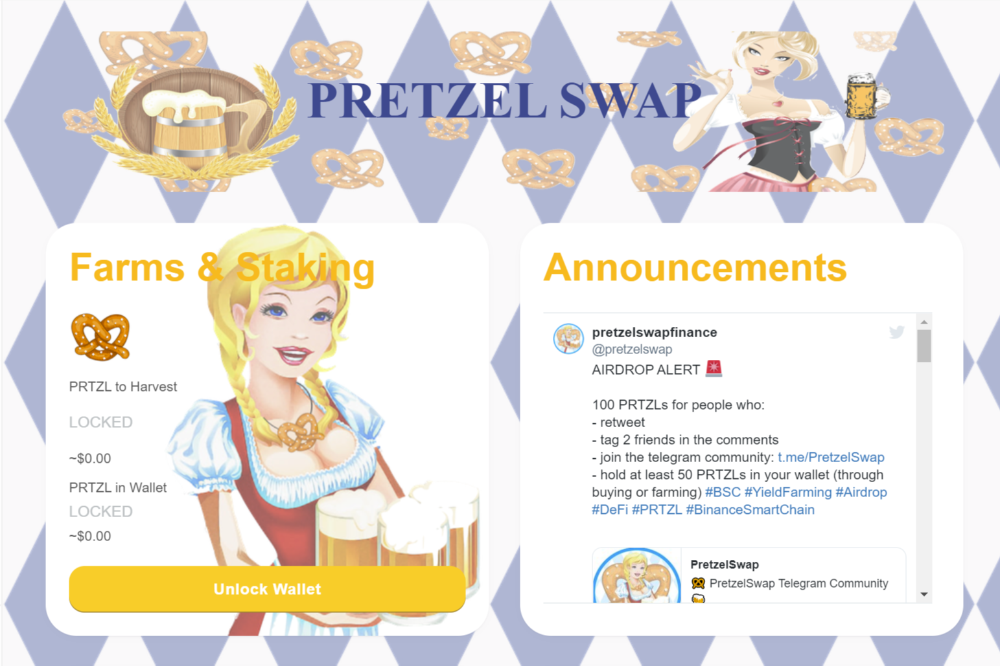

# PretzelSwap

**什么是 PretzelSwap ？**

PretzelSwap 是在币安智能链 (BSC) 和 PancakeSwap 交易所上运行的自动做市商 (AMM)。

PretzelSwap 是完全自给自足的，并且正在完全有机地增长。 

通过小而慢的方法，我们实现了更可持续的长期增长。随着时间的推移，将添加新的农场和游泳池以及其他功能，以保持对我们椒盐脆饼社区的吸引力。所有关于路线图、烧毁等的决定都是通过我们电报组中的社区民意调查来进行的。

PretzelSwap dApp是建立在该协议上的DeFi类别的加密资产。现在，根据用户数量，它在一般的dApp排名中排名第241位，在赌博类别中排名第532位，这使您可以很好地了解PretzelSwap dApp在其竞争对手中的表现。

通过分析过去30天窗口中的PretzelSwap dApp数据，很明显，dApp的余额为62.91美元，交易量为0.00美元。PretzelSwap在30天内产生了0笔交易，下降了0%。显然，与前7天相比，交易量一直在暴跌0%。过去7天的数据显示，PretzelSwap用户群为0，并且一直在增加0%。
