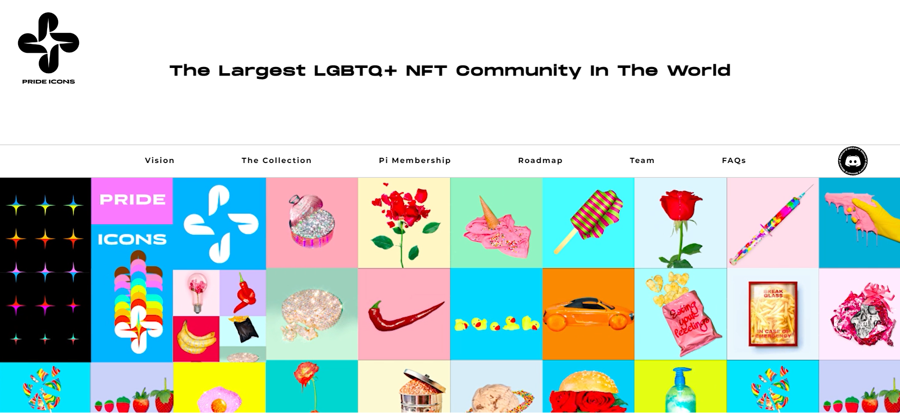

# Pride Icons

Pride Icons 是由 Max Bahman 创建的有限的流行艺术 NFT 数字集合。该系列分为三组，每组都有不同的特征和属性。尽管有些比其他的更稀有，但所有 Pride Icon 都以自己的方式精彩、传奇和独特。就像我们一样。
拥有 Pride Icons NFT 可解锁 Pi 会员俱乐部 3 层之一的会员资格，从而获得会员专属福利、活动等。
在 Pride Icons，我们将社区放在首位！我们与领先的公司和品牌合作，为我们的 Pi 社区成员提供最先进的豪华福利。

