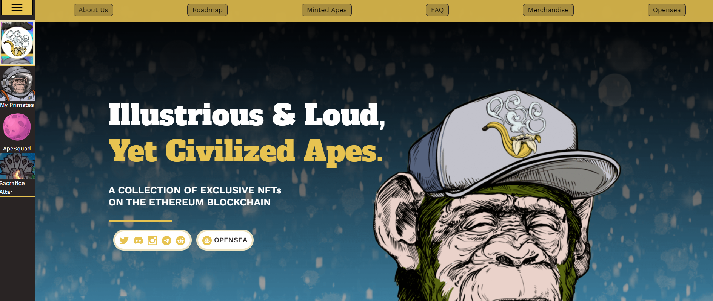

# Primates NFT Collection Official

灵长类社会协会（PSS）是一个复杂的猿化身 NFT 集合，灵感来自我们在 DeFi 中堕落的兄弟姐妹。我们美丽的 Ape Queen Knifebebe 手绘了数百层（每层 2-4 小时），这些层通过算法组装成独特的 Apes。

该协会的上限为 10,000 只猩猩，但由于银背猿，这个数字每天都在减少。这使我们成为首批真正通缩的 NFT 项目之一。

我们设想 PSS 将成为每个人都参与其中且有趣的项目，并且我们将在每个阶段不断地回馈社区。以下是释放灵长类社会社会全部潜力的里程碑的短期地图。未来的路线图将与社区一起制定。

