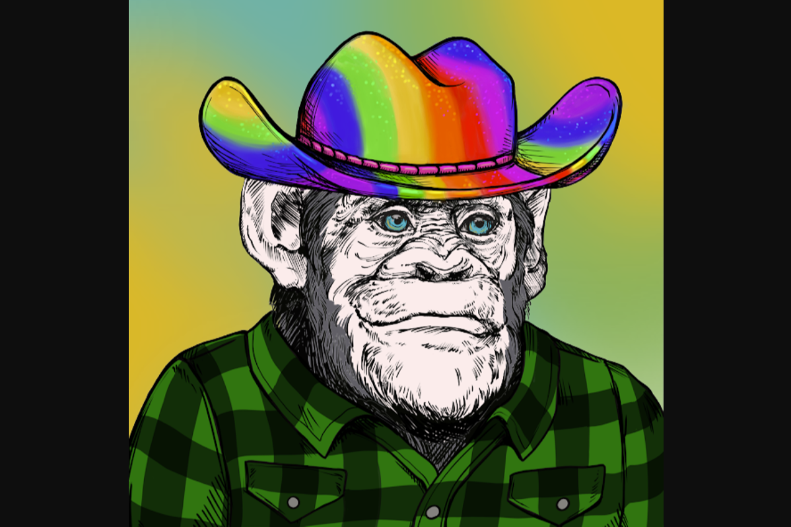

# Primate Social Society

**什么是 Primate Social Society灵长类社会社会？**

Primate Social Society灵长类社会协会是一个复杂的猿化身集合。灵感来自我们在 ApeSwap 的 Defi 空间中的 Degenerate 兄弟姐妹。我们美丽的 ApeQueen 手绘了数百层（每张 2-4 小时），并以编程方式将它们组装成最终的 Ape。

这是限量版系列，上限为 10k。Primate Social Society Apes 将与他们最好的朋友一起使用（大猩猩、婴儿猿和小猫 NFT 将在各自的路线图里程碑向持有者免费提供），用于即将推出的 Primate Social Society CryptoRPG。还将为 The Primate Social Society NFT 的所有者提供独家商品商店和活动等独家优惠。

我们计划将灵长类社会社会整合到不可避免的元节中，并将与其他 GameFi 项目合作，将您的猿作为 PFP 和独家特权带入他们的游戏中。

