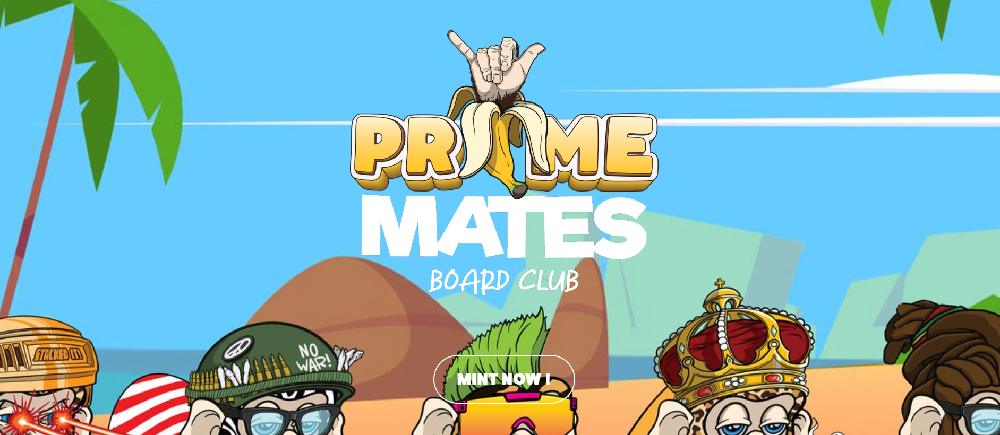

# Prime Mates Board Club NFTs

Prime Mates Board Club 是一个生成的 NFT PFP 集合，其中包含 2222 个独特的手绘灵长类动物碎纸机，准备好在第一季投放到区块链上。

Prime Mates Board Club 提倡与滑板骑行文化以及以这些运动为核心的友情、支持和良好氛围相结合的体验和激情。除此之外，我们还开发了一个独特的协作艺术家网络平台，使用棋盘图形作为协作艺术家的画布，为所有 Prime Mates 持有者提供虚幻的价值和实用性，以及一个以董事会为中心的慈善组织架构，专注于心理健康意识，以确保我们回馈给我们这么多的社区。

