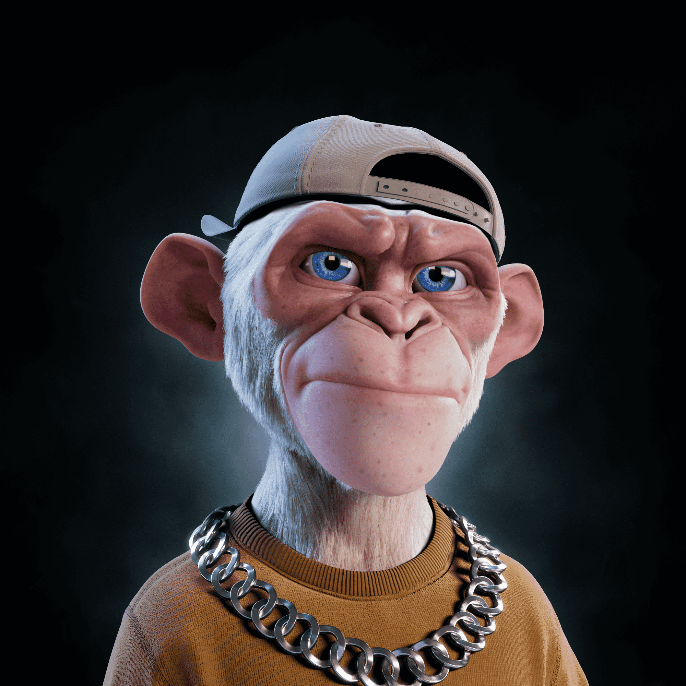

# Prime Ape Planet PAP

我们的猿
之前有很多类人猿，但大多数只是黑猩猩，在元宇宙中没有任何真正的形式或功能。Primus Ethereum 哺乳动物 Prime Apes 是不同的。

类人猿具有自适应能力，并以全 3D 形式出现！不管对他们有什么期望，当赌注如此之高，当生存和在主流文化中留下自己的印记成为优先事项时，猿猴已经准备好了！

我们的杠铃
你见过我们猿猴更大更强的兄弟吗？2022 年第一季度，人类被介绍给猿王国中最强大的生物 Prime Kongs！他们是元宇宙的捍卫者，以其冷静的性格、强大的体格和高智商而闻名，他们将留在这里。

