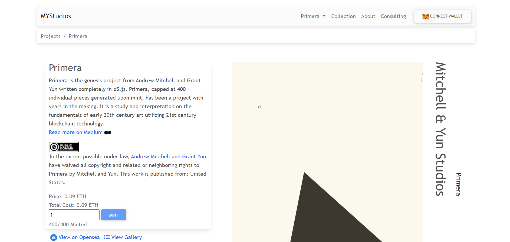

# Primera by Mitchell and Yun

Primera 是 Andrew Mitchell 和 Grant Yun 的创始项目，完全用 p5.js 编写。Primera 的上限为 400 件，这是一个经过多年制作的项目。它是利用 21 世纪区块链技术对 20 世纪早期艺术基础的研究和解释。Primeras都是互动的！

西甲是cc0！在法律允许的范围内，Andrew Mitchell 和 Grant Yun 放弃了 Mitchell 和 Yun 对 Primera 的所有版权和相关或邻近权利。本作品发表于：美国。

