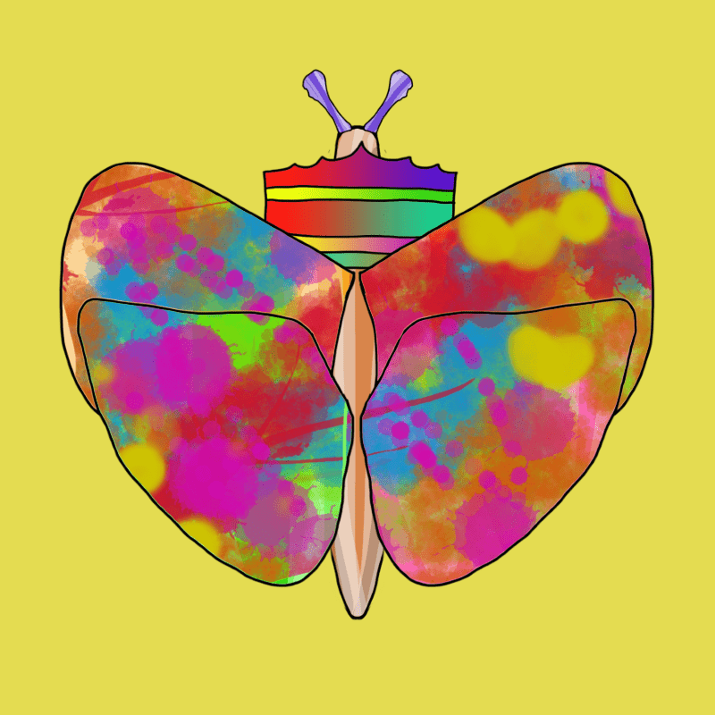

# Empress Princess Butterfly

来自幼儿绘画神童的 5,000 NFT
年仅 4 岁的 Empress 发布了她的第三个备受期待的#nft 系列！这位才华横溢的优秀艺术家和 nft 艺术家从 1 岁开始绘画。Empress 创作了 500 多幅水彩和丙烯酸 1/1 的画作，主要在画布上进行，因此扩展到 NFT 社区，一个提供未来主义机会的空间，是一种自然的蜕变！

Princess Butterflies 系列也是第一个附带教育材料的 nft 系列。请继续关注我们本周的公告。感谢您对“蝴蝶公主”的支持和收藏。您是激励变革、服务和感恩运动的一份子！

