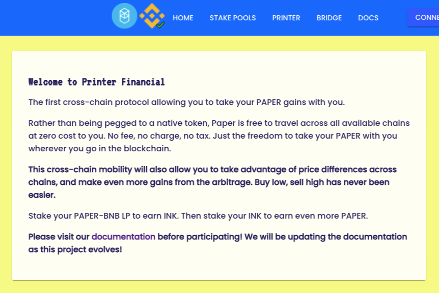

# Printer Financial

**什么是 Printer Financial？**

第一个允许您随身携带 PAPER 收益的跨链协议。

Paper 无需与原生代币挂钩，而是以零成本免费跨过所有可用链。不收费，不收费，不收税。只是在区块链中随身携带 PAPER 的自由。已经在 Fantom 和 Bsc 上推出，未来还会有更多的链。 

这种跨链流动性还可以让你利用跨链的价格差异，并从套利中获得更多收益。低买高卖从未如此简单。

Printer Financial是一个**算法稳定的项目，似乎基于Tomb Finance项目**。强烈建议他们的合同接受与信誉良好的审计师的全面审计，以充分保证他们的社区。这些代码库往往很大且很复杂，具有各种风险向量。

