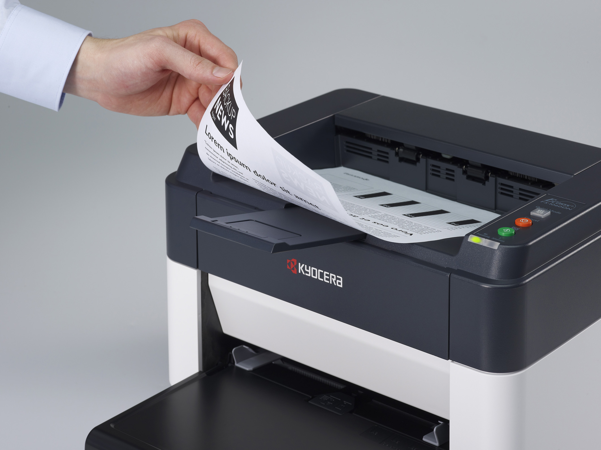

# PrinterShares

**什么是 PrinterShares ？**

在最新一波 DeFi 协议中，我们已经看到许多平台出现，允许用户用他们的资金来换取协议的代币。在本文中，我们将了解 PrineterShares——一种基于币安智能链 (BSC) 的去中心化协议。

PrinterShares Finance 是运行在币安智能链和 Pancake 交换交易所上的去中心化协议，即将推出的功能可以解决一些项目概念问题😯。最重要的是，参与者可以赚取和受益更多😲。

随着时间的推移，我们将 BUDL 和开发永久通货紧缩令牌 PTS，通过独特的通货紧缩机制和功能来稳定和健康地提高价格🤔。这将为整个系统增加价值，并为参与者创造一个稳定的环境，让他们在解决通货膨胀问题的同时以高 APR 收益农场、赌注、玩彩票或...😋。

每块点数：10
最大供应量：无限
燃烧率：每笔交易 1%

