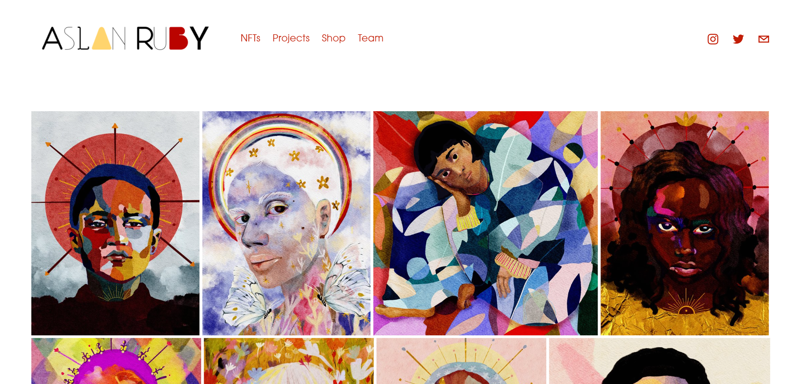

# Print Run by AslanRuby

Aslan Ruby 是一家由夫妻团队 Sarana Haeata 和 Tom Lee 经营的创意设计工作室。Sarana 是该项目背后的艺术家和创意远见者，Tom 将艺术与世界联系起来。他们的工作在 Web3 和 NFT 领域的需求越来越大；他们是 Meta Angels、Honey Badges 和 63 Patron Saints 等项目背后的艺术创作团队。瑞茜威瑟斯彭、兰迪扎克伯格和帕丽斯希尔顿都是他们艺术的收藏家。

除了 Aslan Ruby，Sarana 和 Tom 还抚养着四个女儿（和狗 Bingo），他们在澳大利亚大陆上驰骋。他们目前位于爱丽斯泉。

