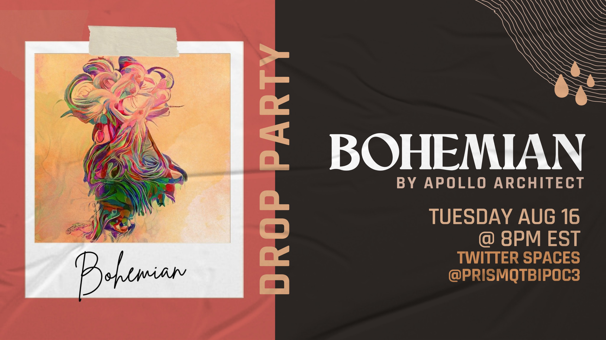

# Prism Collective W3

▶ 什么是 Prism Collective W3？
Prism Collective W3 是一个 NFT（非同质代币）集合。存储在区块链上的数字艺术品集合。
▶ Prism Collective W3 代币有多少？
总共有 3 个 Prism Collective W3 NFT。目前，14 位所有者的钱包中至少有一个 Prism Collective W3 NTF。
▶ 最贵的 Prism Collective W3 销售是什么？
出售的最昂贵的 Prism Collective W3 NFT 是 Prism Pass。它于 2022-06-13（3 个月前）以 130.1 美元的价格售出。
▶ 最近卖出了多少台 Prism Collective W3？
过去 30 天内售出了 5 个 Prism Collective W3 NFT。

