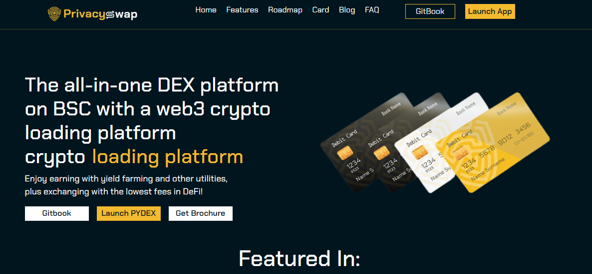

# PrivacySwap

**什么是 PrivacySwap？**

PrivacySwap 的主要目标是让用户安全可靠地使用区块链和 DeFi。它是一群网络安全领域专业人士的心血结晶，他们了解加密货币、区块链和网络安全的优点。区块链是为安全而构建的，那么为什么要冒你的资产风险呢？

PrivacySwap 的目的是聚集一个由来自世界各地的 hodlers、交易者、区块链爱好者组成的社区，目标是创造一个有利于加密市场累积改善的环境，并在适当的时候创造一个更好的互联网。由于 PrivacySwap 走上了一条非常非常规（但已经广受欢迎）的路线——DeFi，这可能很难理解，但在这一点上，它是隐私的最佳起点。

由于 DeFi 在过去几年中获得了极大的欢迎，因此它也是提高知名度的最佳平台是完全有道理的。在这样做的同时，我们希望我们能够通过奖励帮助参与者对他们的时间回报和对 PrivacySwap 的信心保持满意。

PrivacySwap 将通过其治理和实用代币 PRV 实现其私有和安全使用区块链的愿景。PRV 将用于质押以获得奖励，同时使开发人员能够获得这些奖励的一小部分，以进一步推动区块链和 DeFi 的隐私目标。社区在帮助实现隐私方面总是很重要。

在不久的将来，PrivacySwap 打算使 PRV 生态系统将您的加密货币资产的支出和保存与用户隐私放在每一个开发的最前沿，确保您的隐私属于您。

