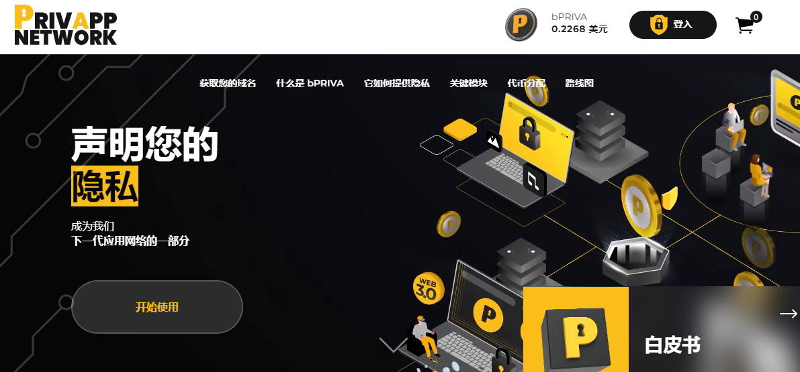

# Privapp Network

**什么是 Privapp Network？**

Privapp Network 由 Priva Token (PRIVA) 和通过 privapp.network 应用程序提供的所有服务组成，不会损害您的安全和隐私。PRIVA 是一种服务于多种用途的实用代币，可确保我们网络的安全和发展。乍一看，PRIVA 是一种多功能代币，可推动最终用户和开发人员的行为。

**bPRIVA**是我们去中心化网络的代币，旨在用于**privapp.network**生态系统的所有 Web 3.0 模块。

