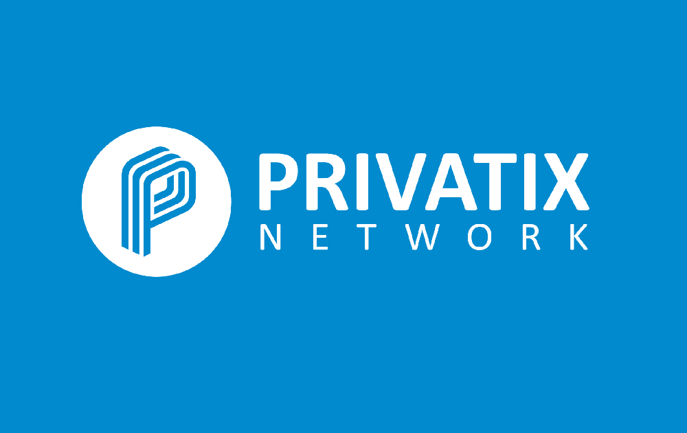

# PrivatixNetwork

**什么是 PrivatixNetwork隐私网络？**

PrivatixNetwork是以太坊上的去中心化和 100% 自主的 P2P 网络，具有由自己的加密经济提供支持的互联网带宽市场。我们的解决方案旨在为互联网用户、开发人员和在线企业提供好处。我们降低了 VPN 消费市场的成本和利润，消除了中间商，让人们能够共享（并从共享中获利）他们的备用宽带连接。” 

任何用户都可以将他的备用或闲置互联网宽带出售给网络，并通过加密立即获得报酬。付款来自买家，他们通过第三方应用程序或直接购买带宽。Privatix 网络建立在透明的加密经济原则之上。用于在网络内买卖数据的唯一实用代币是 ERC20 以太坊代币 - PRIX

Privatix Network Core 的主网版本包括代理和客户端。客户端在高级和简单模式下可用。

带宽价格和付款以 PRIX 为单位，但需要一些 ETH 来支付 gas 成本。带宽成本可能会有所不同。核心软件是测试版，使用它需要您自担风险。可在此处获得测试网版本。

