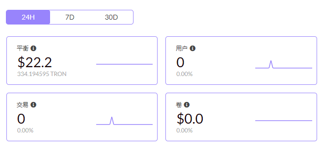

# Privvy (PVX)

**什么是 PRIVVY（PVX）？**

PRIVVY (PVX) 是 Tron 区块链上第一个以隐私为导向的DEFI 代币。 Tron区块链上的隐私币。

私人用户的余额是隐藏的，转账在 tronscan 和智能合约上是隐藏的。隐形转账功能（特殊的 SmartContract 功能）允许用户将 PVX 从一个钱包转移到另一个钱包而不留下任何痕迹。

它是快速和免费的，0 费用，0 预挖，社区可开采的流动性证明。

Privvy是TRON令牌。它关注隐私和匿名性。这意味着，您可以以私人方式交易PVX令牌，远离Tronscan。代币可以在不同的钱包之间发送，没有任何地方出现它发生的记录。这是一个分散且无需信任的项目。

**Privvy （PVX） DAPP 技术分析**

Privvy（PVX）dApp是建立在Tron协议上的DeFi类别的加密资产。现在，根据用户数量，它在一般的dApp排名中排名第7675位，在DeFi类别中排名第1622位，这使您可以很好地了解Privy（PVX）dApp在其竞争对手中的表现。

通过分析过去30天窗口中的Privy（PVX）dApp数据，很明显dApp的余额为22.22美元，交易量稳定为0.00美元。Privvy （PVX） 在 30 天内生成了 1 个事务，增长了 100%。显然，与前7天相比，交易量稳定了0%。过去7天的数据显示，Privvy（PVX）用户群为1，并且稳定了0%。

