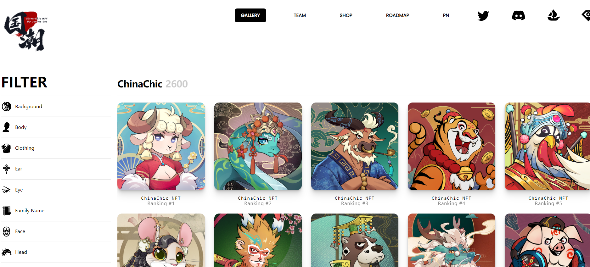

# Probably Nothing by ChinaChic NFT

▶ 什么是 ChinaChic NFT 的可能一无所有？
ChinaChic NFT 的大概Nothing 是一个NFT（非同质代币）集合。存储在区块链上的数字艺术品集合。
▶ ChinaChic NFT 代币可能没有多少？
ChinaChic NFT NFT 总共有 1,185 个可能没有。目前，744 位所有者的钱包中至少有一个可能没有 ChinaChic NFT NTF。
▶ ChinaChic NFT 销售中最贵的可能是什么？
ChinaChic NFT NFT 出售的最昂贵的可能没有是 #78。它于 2022 年 6 月 9 日（3 个月前）以 54.6 美元的价格售出。
▶ ChinaChic NFT 最近卖出了多少份可能没有的东西？
过去 30 天内，ChinaChic NFT 出售了 7 个可能没有 NFT。
▶ ChinaChic NFT 替代品中流行的可能没有什么？
许多拥有ChinaChic NFT NFTs可能没有的用户还拥有 Weiner Fish、 EL NUMEROS、 DegenOkayBears和 WaterBe4nZuki。

