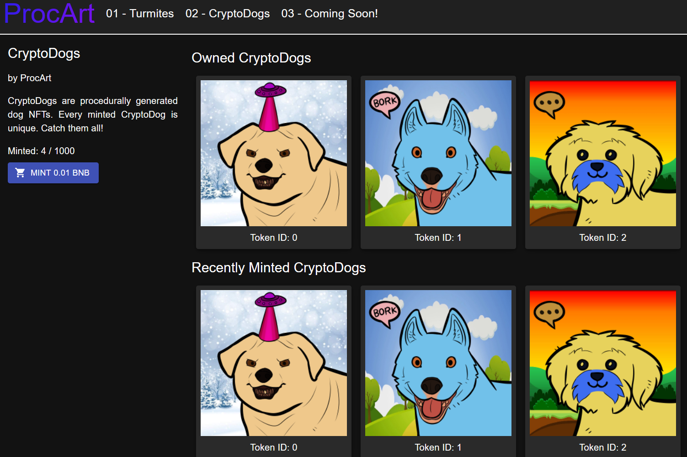

# ProcArt

**什么是 ProcArt ？**

ProcArt 是币安智能链 (BSC) 上的第一个去中心化应用 (dApp)，专注于销售程序生成艺术的不可替代代币 (NFT)。

ProcArt 目前有 2 个 NFT 集合（Turmites 和 CryptoDogs），还有更多！

**什么是程序生成的艺术？**
程序生成是一种通过算法而不是手动创建数据的方法，通常通过将人工生成的资产和算法与计算机生成的随机性和处理能力相结合。

**什么是 NFT？**

不可替代令牌 (NFT) 是存储在称为区块链的数字分类账上的数据单元，它证明数字资产是唯一的，因此不可互换。NFT 可用于表示照片、视频、音频和其他类型的数字文件等项目。

**我可以交易或出售我的 NFT 吗？**

是的，ERC721 NFT 可以交易。我们正在为该网站建立一个贸易版块。
