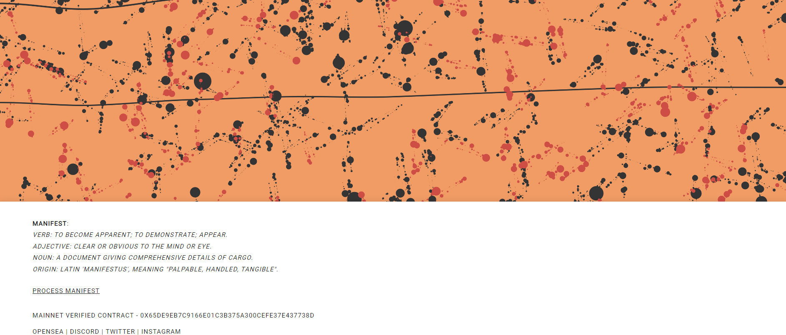

# processed (art): manifest

▶ 什么是加工（艺术）：显化？
已处理（艺术）：清单是 NFT（不可替代令牌）集合。存储在区块链上的数字艺术品集合。
▶ 有多少已处理（艺术）：清单代币存在？
总共有 213 个已处理（艺术）：清单 NFT。目前，104 位所有者至少拥有一项已处理的（艺术品）：在他们的钱包中显示 NTF。
▶ 加工（艺术品）：清单最近卖出了多少？
有 0 个已处理（艺术）：最近 30 天内出售的清单 NFT。

